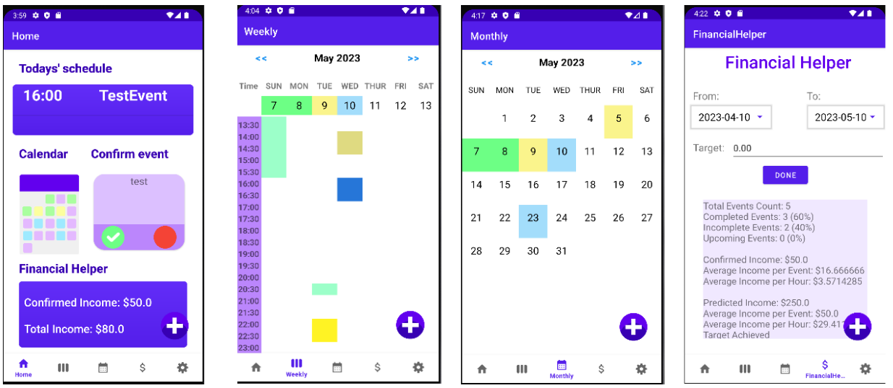
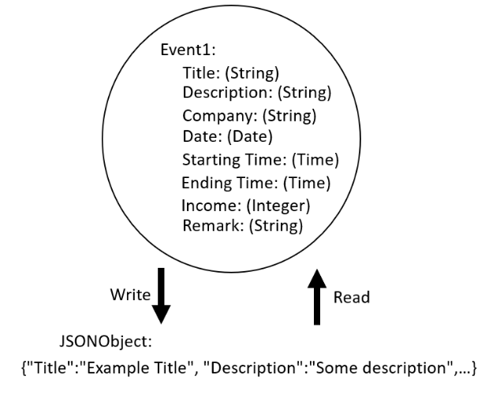
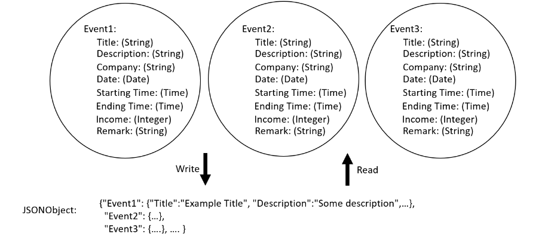

# Freelendar Overview

This is the overview of "a Calendar application designed for the freelancer", namely Freelendar, a self-proposed project for the course COMP4521 of The Hong Kong University of Science and Technology in 2022-2023.

## Introduction
"Freelendar" is a Calendar application designed for the freelancer to mark down all daily income activities, including completed work and future work. Different from employees, freelancers usually work on multiple projects with distinct companies. Tutors and artists are typical examples of freelancers nowadays. However, since they do not have a rigid working schedule, consequences including chaotic timetables and poor financial management come along with the flexibility brought. In light of this, "Freelendar" aims to help freelancers manage their daily activities and income flow. The project focuses on developing a Android mobile application using the Android Studio with the following functions: schedule management, work notification, and financial report visualization.

## Methodology

## Application Structure (User Interface)
The application consists of four activities, including the main activity and three intents. The main activity contains the majority of features, including a navigation bar, allowing users to switch between five fragments, namely the Home view, the Weekly view, the Monthly view, the Financial helper view, and the Setting view. The three intents allow users to add, confirm, and review or delete events in the calendar we provided. In the following section, we will discuss our design for different activities, and the details of the implementation in the main activity, equivalently the navigation system.

## Data Storage
We implemented an Event class object to represent each user event. In our Event object, it comprises eight attributes that can be converted to a string or numeric value easily. We used JSON files as our data storage. Using JSONObject, we can combine all events as a string in light of structural clarity. We implemented a method to convert an Event object to a JSON string as shown in the following figure, allowing us to convert the attributes into a single string. Furthermore, we implemented a method to convert a JSON string to the original Event object, enabling us to construct the Event object after reading the string data from the JSON file.

With the support of the JSONObject library, we can set a JSONObject value as a child of a parent JSONObject, and combine multiple events as shown below. And hence, the system can fetch and store all events by reading a single file with ease.

Moreover, in light of the readable string property of JSONObject, we can implement cloud synchronization with SQL which only needs to backup or restore the data with a single string field. The SQL synchronization feature will be implemented in our future work.

## Project Information

##### Topic Full Name

- Freelendar

##### Group Members
- NG Chun Fung (https://github.com/cfngai)
- LEUNG Chi Yin (https://github.com/cyleungbj)
